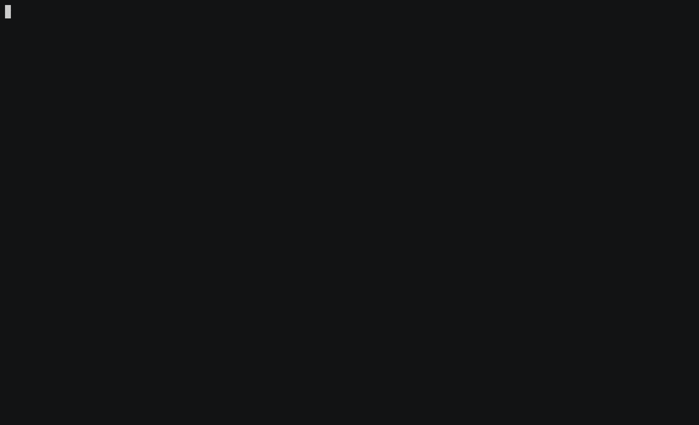

#  Popper

[](https://pepy.tech/project/popper)
[](https://travis-ci.org/systemslab/popper)
[](https://gitter.im/falsifiable-us/popper?utm_source=badge&utm_medium=badge&utm_campaign=pr-badge&utm_content=badge)
[](https://badge.fury.io/py/popper)
[](https://github.com/systemslab/popper/blob/master/LICENSE)

Popper is a workflow execution engine based on [Github 
actions](https://github.com/features/actions) (GHA) that allows you to 
execute GHA workflows locally on your machine. Popper workflows are 
defined in [HCL](https://github.com/hashicorp/hcl) syntax and behave 
like GHA workflows. The main difference with respect to GHA workflows 
is that, through [several extensions to the GHA 
syntax](https://popper.rtfd.io/en/latest/sections/extensions.html), a 
Popper workflow can execute actions in other runtimes in addition to 
Docker. The workflow language is strictly a superset of GHA workflow 
language so Popper can run a GHA workflow locally as if it was being 
executed by the GHA platform.

<p align="center">
  
</p>

In addition to running a GHA workflow locally, the goal of this 
project is to provide the following functionality:

  * **Runtimes**. Actions can execute locally on the host where the 
    `popper` command runs (i.e. "outside" a container), thus not 
    strictly depending on having Docker installed. We are working in 
    adding support for other runtimes such as 
    [Vagrant](https://www.vagrantup.com/), 
    [Singularity](https://sylabs.io/), [Conda](https://conda.io) and 
    others (see [this 
    project](https://github.com/systemslab/popper/projects/12) for 
    more).
  * **Continuous integration**. Generate configuration files for 
    distinct CI services, allowing users to execute Popper workflows 
    on these services (Travis, Jenkins, Gitlab and Circle supported).
  * **Action and workflow search**. Provide users with a searchable 
    catalog of available actions and workflows so that they can re-use 
    as much as possible what others have already done.
  * **Scaffolding**. Aid in the implementation of new actions and 
    workflows, as well as extending existing ones.
  * **Action library**. As part of our efforts, we maintain a list of 
    actions available at <https://github.com/popperized>.

-----

This repository contains:

  * [`cli/`](cli/). The codebase of the CLI tool.
  * [`docs/`](docs/). General 
    [documentation](https://popper.readthedocs.io/en/latest/) 
    containing guides, CLI documentation and pointers to other 
    resources.
  * [`gh-pages`](https://github.com/systemslab/popper/tree/gh-pages) 
    branch. Contents of our [landing page](http://falsifiable.us).

## Installation

We have a [`pip`](https://pypi.python.org/pypi) package available. To
install:

```bash
pip install popper
```

Once installed, you can get an overview and list of available 
commands:

```bash
popper --help
```

For a quickstart guide on how to use the CLI, look 
[here](https://popper.readthedocs.io/en/latest/sections/getting_started.html).

## Contributing

Anyone is welcome to contribute to Popper! To get started, take a look 
at our [contributing guidelines](CONTRIBUTING.md), then dive in with 
our [list of good first 
issues](https://github.com/systemslab/popper/issues?utf8=%E2%9C%93&q=is%3Aissue+label%3A%22good+first+issue%22+is%3Aopen) 
and [open projects](https://github.com/systemslab/popper/projects).

## Participation Guidelines

Popper adheres to the code of conduct [posted in this 
repository](CODE_OF_CONDUCT.md). By participating or contributing to 
Popper, you're expected to uphold this code. If you encounter 
unacceptable behavior, please immediately [email 
us](mailto:ivo@cs.ucsc.edu).
